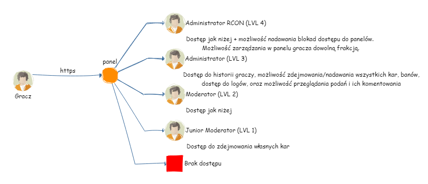

# MTAWEB-Panel-Admina

Hejka, cześć z Was może mnie kojarzyć jako Break. lub Marek. Działając na strefie MTA tworzyłem kilka serwerów MTA, w jednym większym jako Moderator (PYL)

# Co to jest?

Są to odpowiednio panel www admina i gracza pod XyzzyRP (Jeżeli AFX nie opublikuje to również będą pasować do zasobów z Play Your Life)
Panele są troszeczkę już mocno zmienione (przynajmniej mi się tak wydaje) względem wersji początkowej - Panelu z zasobu https://github.com/lpiob/MTA-XyzzyRP

Głównym wymogiem jest własnie baza danych z XyzzyRP i prosty serwer www.

# Działanie

Panel łączy się przez MySQL z bazą danych serwera i pobiera z niej dane. Wszystko opiera się na strukturze dostępu, która przedstawia się tak. Oczywiście mowa o panelu admina - do panelu gracza może zalogować się każdy gracz.

# Panel Admina - Funkcje

W panelu admina można z poziomu przeglądarki przeglądać logi (dostarczę skrypt który bedzie je wysyłał później), zdejmować/nadawać kary oraz bany, przeglądać historię graczy.

# Panel Gracza - Funkcje

W panelu gracza główną rzeczą jest generowanie pasków, oraz dla liderów frakcji możliwość przez przeglądarkę zarządzania strukturą HR frakcji (dodawanie, usuwanie, edycja rang)
Z tego panelu na potrzeby jednego projektu również można brać udział w rekrutacjach na np. stanowiska administracyjne. Trafiają one do panelu admina gdzie komentować można od rangi 3 a edytować status od rangi 4. 
